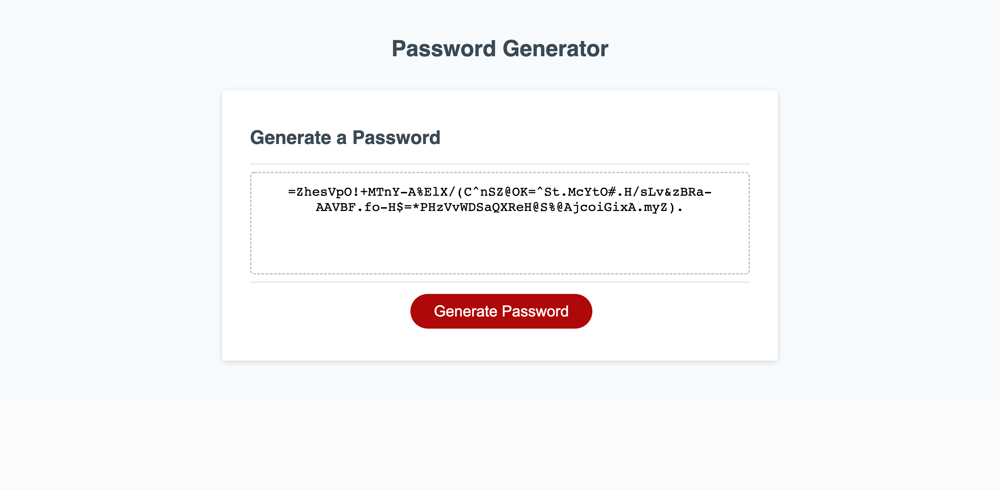

# Password-Generator-week-3-js
Idea:
* 1-Create an library stores all the characters including :number, lowercase,uppercase, special characters.
* 2- When we click a generate button, the code will do the function that randomly choosing the characters by the results of user's input. (use the Math.floor and Math.random ) and use "for loop", "if" statment to programically run the code.
* 3- Then we need to make sure , the input's result followed to the criterias. For example: 8<=lenght<=128. If not stop running and show alert.

Implement:

* Set variable for number, text(lower or upper case), and special character. 
* When click a button , will do a function call "writePassword"
* The function "writePassword" will be run and show the value in defined area if:

* * the prompt (input's results) is true and 
* * Algorithim use in "for loops"s function implemented. The out put will randomly choose values followed to what users input in "promt"

* In the prompt function we put all the criteria for the input to make sure the users import proper values.

#Screenshot

 

